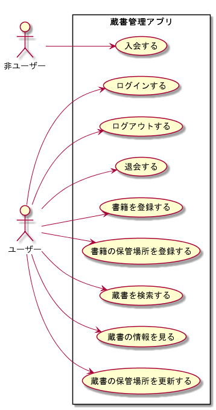

# 書籍管理アプリ　ソリューションアウトライン

## 要件一覧

* 入会する
* ログインする
* ログアウトする
* 退会する
* 書籍を登録する
* 書籍の保管場所を登録する
* 書籍の情報を見る
* 蔵書を検索する
* 蔵書の保管場所を検索する
* 書籍の保管場所を更新する

## ユースケース図

## ユースケース記述

1. [UC1_入会する](usecase_descriptions/uc1_入会する.md)
1. [UC2_ログインする](usecase_descriptions/uc2_ログインする.md)
1. [UC3_ログアウトする](usecase_descriptions/uc3_ログアウトする.md)
1. [UC4_退会する](usecase_descriptions/uc4_退会する.md)
1. [UC5_書籍を登録する](usecase_descriptions/uc5_書籍を登録する.md)
1. [UC6_書籍の保管場所を登録する](usecase_descriptions/uc6_書籍の保管場所を登録する.md)
1. [UC7_蔵書を検索する](usecase_descriptions/uc7_蔵書を検索する.md)
1. [UC8_蔵書の情報を見る](usecase_descriptions/uc8_蔵書の情報を見る.md)
1. [UC9_蔵書の保管場所を更新する](usecase_descriptions/uc9_蔵書の保管場所を更新する.md)